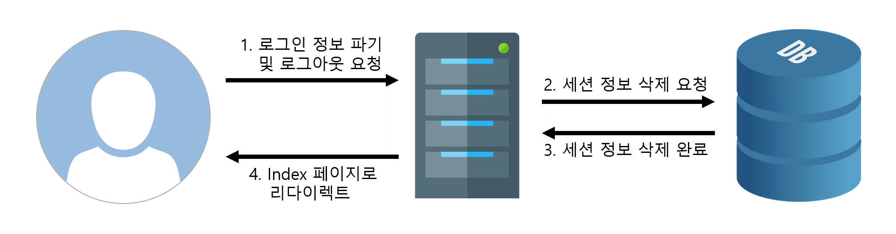
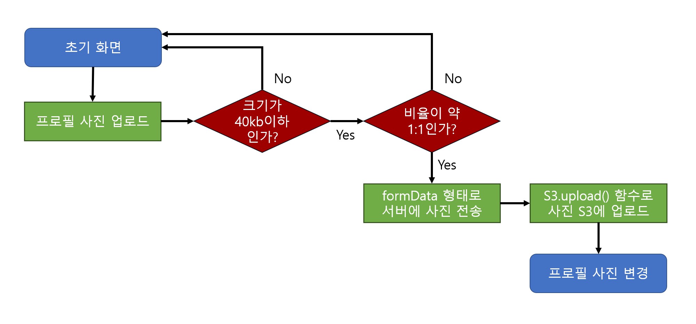

# 영화 트레일러 사이트
영화 트레일러를 전문적으로 모아놓은 사이트를 구현한 포트폴리오입니다.

## 링크 주소
[바로 가기](https://www.movientrailer.com)

## 기술 스택
* HTML,CSS, JavaScript
* React, Redux, Webpack, Babel
* NodeJs, Express, Mongo DB Cluster
* AWS EC2, S3, Cloudfront, Route 53, Certification

## 구현 기능
* 동영상 관련 기능 구현
  * 기존 PiP모드에서는 동영상 자막을 불러오지 못하는 단점이 존재하여, PiP모드를 자체적으로 구현함
  * PiP모드 시 드래그를 통한 크기 조절, 이동 기능 구현
  * 동영상 해상도 및 자막 선택 기능 구현

* 세션을 통한 회원 가입, 로그인 기능 구현
  * 사용자의 세션 정보를 비교하여 해당 사용자의 로그인 여부 등을 파악
  * 프로필 사진 업로드 기능 구현
  * 사용자 본인이 남긴 댓글 기록과 영화 시청 기록을 열람 가능함

* Nosql DB + Redux를 활용한 영화 정보 + 댓글 정보 저장 구현
  * 댓글 정보가 정형화하기 어려운 형태이므로 nosql DB를 활용함
  * Redux store에 정보를 저장하고, 그것을 재사용하여 서버와 클라이언트 간의 통신 비용 최소화
  * 현재 시청 중인 영화의 댓글 작성 기능, 영화와 댓글 좋아요 기능, 스크랩 기능 구현

* 반응형 웹 구현
  * 현재 기기를 감지하여 해상도에 따른 UI 크기나 글자 등을 조절

* 슬라이드 및 애니메이션 구현
  * 라이브러리를 사용하지 않은 순수 자바스크립트로만 구현

* AWS 서비스와의 연동
  * EC2에 linux 기반의 가상 머신으로 웹 서버 구축(Node js + Express)
  * S3와 Cloudfront로 백엔드와 파일 서버 간의 통신 처리
  * Route 53과 Certification으로 Https 프로토콜 구현

## 주요 기능 설명
### PiP모드 구현
 ※ video player 구현은 video.js 7.9.5 버전을 이용하였으나 API에서 지원하는 기본 UI와 최소한의 기능만을 사용했다.
#### 개선점 및 구현 방법
 - 브라우저의 기본 미디어 플레이어는 PiP 모드로 실행할 때 외부 자막이 표시되지 않는 문제점이 있었기에, 외부 API를 기반으로 PiP 모드를 직접 구현하여 이런 문제점을 해결하고자 했다. 
 - 미디어 플레이어의 기본모드와 PiP모드의 전환은 WatchApp 컴포넌트의 NormalToPiP() 또는 PiPToNormal() 함수에 의해 이루어지며, 어느 함수가 실행될지 여부는 Redux store에 저장된 미디어 플레이어 상태값에 의해 결정된다.
 - NormalToPiP() 함수가 호출될 경우 normalWindow div 태그 내의 video 태그 전체가 pipWindow div 태그의 내부로 이동하며 재생 중인 플레이어 또한 pipWindow 내부에 표시되게 된다.

 - 반대로 PiPToNormal() 함수가 호출될 경우 위의 동작이 반대로 수행되며 재생 중인 플레이어는 normalWindow 내부에 표시되게 된다.
 - PiP모드 중에 다른 페이지로 이동시에도 해당 영상을 계속 시청할 수 있으며, 원래 페이지로 돌아오면 PiP모드가 해제된다.
#### PiP모드에서 UI의 이동 및 크기 조절 구현
 - PiP모드에서는 마우스로 UI를 이동시키거나 크기 조절을 할 수 있다.
 - UI의 이동은 pipWindow의 style top과 left 값에 변화를 줌으로써 구현했으며 각각의 값은 mouse position의 client값과 offset값의 차로 계산했다.

 - UI의 크기 조절은 pipWindow의 style height과 width에 현재의 mouse position과 이전 mouse position의 차를 더해주었다.
 - 하지만 UI의 크기만 조절하면 pipWindow의 화면 상 절대위치가 변동돼서 원하는 대로 크기가 조절되지 않는 문제점이 있었다.

 - 이를 해결하기 위해 pipWindodw style의 top과 left 값에 pipWindow의 client top(width)값에 현재의 mouse position과 이전 mouse position의 차를 더해주어, UI의 크기가 조절되면 top과 left 값도 같이 변하도록 설정했다.

### 동영상 해상도 및 자막 전환 기능 구현
 - 영상의 경우 m3u8 파일과 ts파일을, 자막의 경우 vtt 파일을 사용했다.
 - 해상도 전환 요청이 들어오면 현재 재생 시간과 선택한 해상도에 맞는 ts 파일을 내려받아 보여준다.

 - 자막 전환의 경우에도 요청이 들어오면 해당 자막과 일치하는 vtt파일로 source를 전환하는 방식으로 구현했다.

### 세션을 통한 회원 가입, 로그인 기능 구현
 - 기본적으로 사용자의 식별은 세션 정보를 통해서 진행된다.
 - 사용자가 로그인을 하면 로그인 당시의 세션 정보를 DB에서 저장하고 클라이언트에 로그인 정보(중요 정보 제외)를 전달한다.

 - 로그인 정보는 클라이언트의 Redux store에 저장되며, 클라이언트가 서버와 통신할 때마다 클라이언트의 Redux store에 저장된 로그인 정보와 DB에 저장된 세션 정보가 일치하는지 확인한다.
 - 사용자가 로그아웃 시 DB에 저장되어 있던 세션 정보와 Redux store에 저장된 로그인 정보를 파기한다.

 - 각각의 페이지에 접근하기 전에 AuthCheckRoute() 함수가 실행되어 접근 권한을 확인하는데, 접근 권한이 없을 경우 index 페이지로 redirect된다.

### 프로필 사진 업로드 및 수정 기능 구현
 - 사용자는 본인이 원하는 프로필 사진을 업로드 할 수 있으며, 40kb 이하이고 1:1 비율에 근접한 사진(약 5% 내외까지 허용)만 사용할 수 있다.
 - 클라이언트에서 검증이 완료된 사진은 form data 형태로 서버에 보내지며 AWS S3 API를 통해 S3에 업로드 된다.

 - 사진이 업로드 되면 프로필 사진이 즉각적으로 변경되며, 변경 이전에 작성했던 댓글의 프로필 사진에는 이러한 변경점이 반영되지 않는다.

### History 기능 구현
 - 사용자 정보 collection에서는 사용자 본인이 작성한 댓글들의 기록과 영화 시청 기록을 각각 10건씩 저장한다.
 - 사용자가 댓글을 작성하거나 재생 버튼을 눌러 영화를 시청하게 되면 collection에 해당 history를 저장한다.
 - 저장된 건이 이미 10건을 넘었을 경우에는 Queue처럼 목록에서 저장된 첫 번째 인덱스의 기록을 꺼내고, 마지막 인덱스에 새로운 기록을 삽입한다.
 
 - 해당 기록을 누르면 사용자가 시청했던 영화 기록이나 남겼던 댓글 위치로 이동할 수 있다.
 - 댓글로 이동하는 기능은 댓글의 고유 id와 path가 일치하는 DOM을 검색하여 scrollIntoView() 함수로 이동하는 방식으로 구현했다.

### Nosql DB + Redux를 활용한 영화 정보 + 댓글 정보 저장 구현
 - 홈페이지 특성상 영화와 댓글 정보는 밀접한 관계가 있고, 각각의 depth가 달라 정형화하기 어려운 형태이므로 nosql DB를 사용했다.

 - 클라이언트는 최초 접속 시 서버와 통신하여 object 형식으로 된 영화 정보를 받아 클라이언트 내의 Redux store에 저장한다.
 - 이후 해당 정보가 필요하면 다시 서버와 통신하지 않고 후 필요할 때마다 Redux store에 저장된 값을 사용한다.

 - 만약 갱신된 정보가 필요할 때는 클라이언트는 다시 서버와 통신하여 최신 정보를 받은 후 Redux store에 해당 정보를 갱신한다.

### 댓글 기능 구현
#### 댓글의 구조 및 rendering 방식
 - 댓글은 부모 댓글 object 안에 자식 댓글 object가 포함된 형태이며, 각각의 자식 댓글이 부모 댓글과 같은 형태를 보이는 재귀적인 구조로 이루어져 있다.
###

####

 - 따라서 댓글을 rendering 하는 renderComment() 함수 또한 재귀함수로 구현하였다.
 - renderComment()를 호출하면 파라미터로 넣은 댓글 object의 자식 댓글 object의 개수부터 체크한다.
 - 만약 자식 댓글 object의 length가 1 이상이면 자식 댓글 object의 개수만큼 renderComment() 함수를 호출하면서 댓글들을 rendering 한다.

#### 댓글의 작성, 수정, 삭제
 - 각각의 댓글 정보 object에는 댓글마다 식별 번호를 의미하는 고유한 id가 존재한다.
 - 이 고유 id는 사용자가 댓글을 작성할 시 서버에서 발급한다.
 - 또한, 클라이언트 상에서 댓글 작성, 수정, 삭제 버튼을 누르면 DOM의 특성을 이용해 해당 댓글까지 찾아갈 수 있도록 id를 통한 경로를 산출하는데 이 결과 값을 path라고 한다.

 - 클라이언트가 댓글 요청을 하면 서버는 request로 받은 path를 통해 DB 상의 path에 있는 댓글 정보 object에 접근하게 되며, 유형에 따라 아래와 같이 댓글 정보를 수정 후 그 결과를 클라이언트에 전달한다.
   1. 댓글 작성 요청 시 : 'reply' key에 작성한 댓글 정보 object를 value로 저장한다.
   2. 댓글 수정 요청 시 : 'updatedDate' key에 현재 날짜를 value로 저장하고, 'description' key에 수정한 내용을 value로 저장한다.
   3. 댓글 삭제 요청 시 : 'deletedDate' key에 현재 날짜를 value로 저장한다.
 - 클라이언트가 서버로부터 정상적인 response를 받으면 웹 페이지에 갱신된 댓글 정보가 표시된다.

### 영화 또는 댓글 좋아요 기능 구현
 - 영화와 댓글의 좋아요 수(vote count)는 DB의 영화 정보 colletion에서 관리하며, 해당 영화 또는 댓글의 추천 여부는 사용자 정보 collection에서 관리한다.
 - 영화 또는 댓글의 좋아요 버튼을 눌렀을 경우, 우선 사용자 정보 collection에서 해당 영화 또는 댓글의 추천 여부를 먼저 확인한다.
###

 - 만약 좋아요를 이미 했었다면 사용자 정보 collection에서 내역을 지우고, 영화 정보 collection에 해당하는 영화 또는 댓글의 좋아요 수를 감소시킨다.
 - 만약 좋아요를 하지 않았다면 사용자 정보 collection에서 내역을 추가하고, 영화 정보 collection에 해당하는 영화 또는 댓글의 좋아요 수를 증가시킨다.
 - 영화의 스크랩 기능도 위와 같  방식으로 구현했다.

### AWS Service와의 연동
 - 웹 페이지를 구현할때 사용된 호스팅용 서버, 파일 서버, 도메인, 인증서 발급 서비스는 AWS에서 제공하는 것을 사용했다.
 - 호스팅용 서버는 리눅스 기반의 AWS E2를 사용했으며, 주소창에서 http 주소로 접근하거나 서브 도메인을 생략할 시 EC2에서 제공하는 로드 밸런서를 통하여 올바른 주소로 redirect 하도록 처리했다.
 - 파일 서버는 AWS S3를 사용했으며, Cloudfront를 이용하여 사용자가 세계 어느 곳에서 접속하더라도 일정한 loading 시간을 보장받도록 설정했다.
 - 도메인과 인증서는 AWS route 53과 AWS Certification에서 발급받아 사용했으며 이를 통해 https 프로토콜을 구현했다.
